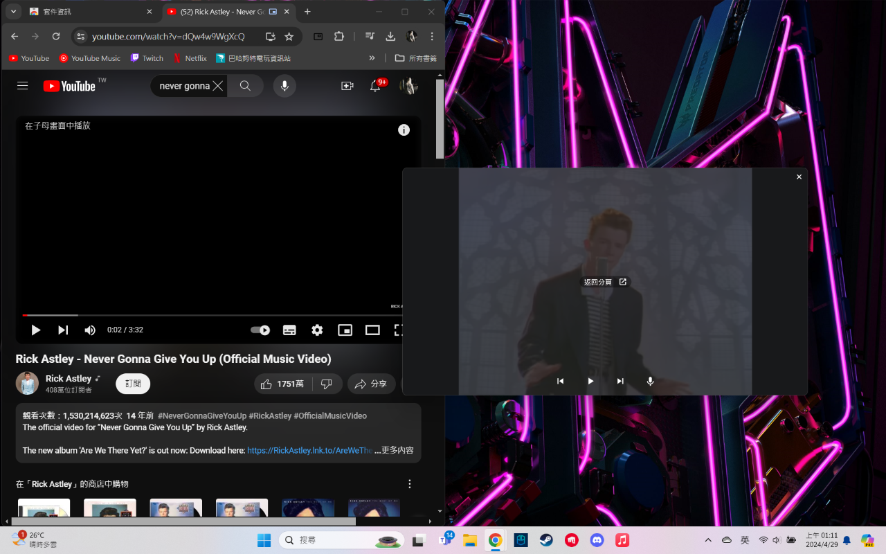

# Picture in Picture with controls
This is a google extension combine [Picture-in-Picture API](https://developer.mozilla.org/en-US/docs/Web/API/Picture-in-Picture_API) & [Media Session API](https://developer.mozilla.org/en-US/docs/Web/API/Media_Session_API) to make the floating window controllable. 
Here is the [google extension page](https://chromewebstore.google.com/detail/picture-in-picture-with-c/dfipjlkcgbenndhgliggacdpplelplei)
## How to use

Download the extension and click it, a popup page will shown like above screen shot 
You can customize your forward/backward second and playbacke speed 
Press **[PLAY]** button if all setting are done.

  are seek forward/backward 
 is control of playback speed 
Using these such not intuitive icons is because Media Session API's some action didn't shown on PIP window 
What I can do is to choose other action to make icon shown so now is controllable
