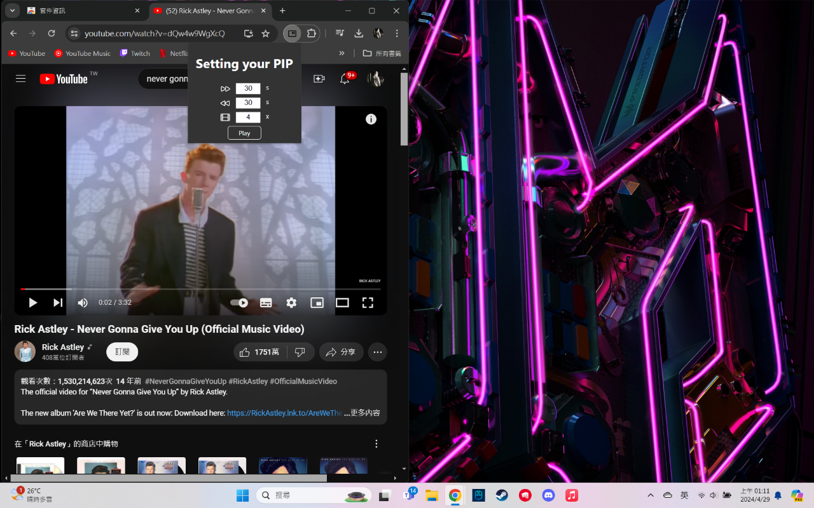

# Picture in Picture with controls
This is a google extension combine [Picture-in-Picture API](https://developer.mozilla.org/en-US/docs/Web/API/Picture-in-Picture_API) & [Media Session API](https://developer.mozilla.org/en-US/docs/Web/API/Media_Session_API) to make the floating window controlable. 
Here is the [google extension page](https://chromewebstore.google.com/detail/picture-in-picture-with-c/dfipjlkcgbenndhgliggacdpplelplei)
## How to use

Download the extension and click it, a popup page will shown like above screen shot 
You can customize your forward/backward second and playbacke speed 
Press **[PLAY]** button if all setting are done.

After pressing PLAY button 
